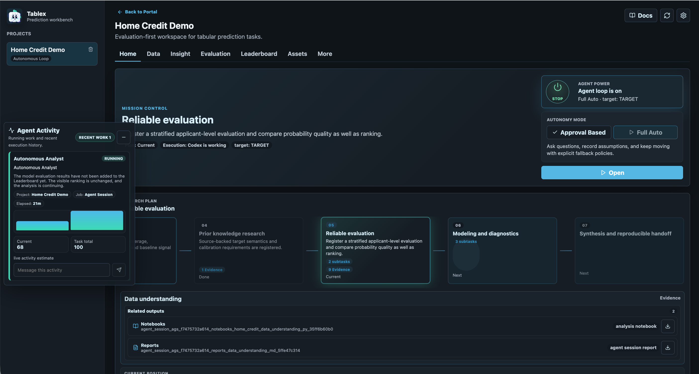
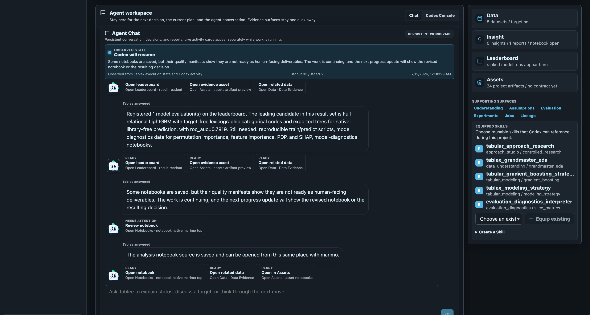
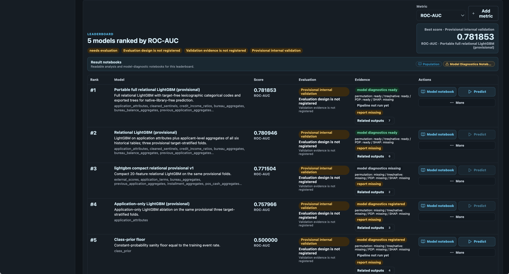
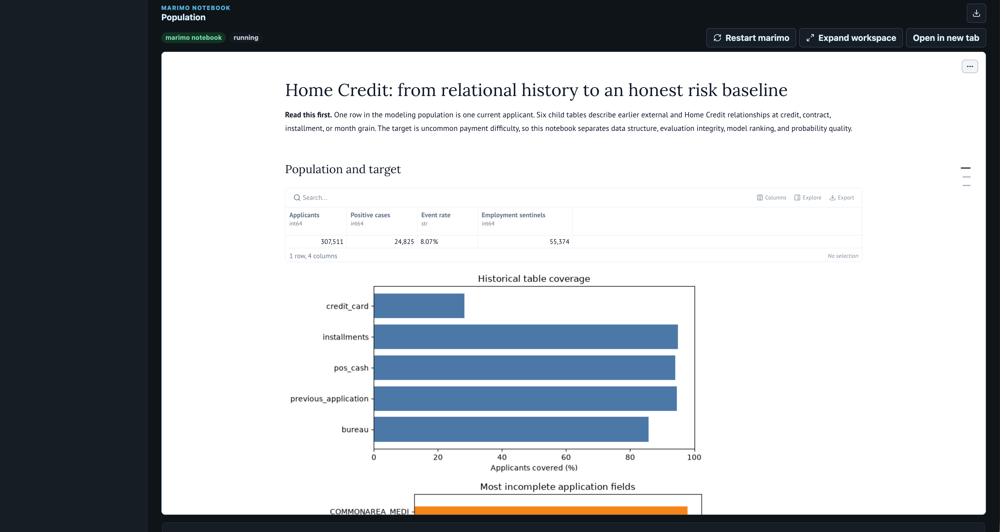

# Tablex

Tablex is the current working name for a tabular-first agentic data science workbench. It runs alongside Codex or another `AgentRunner`: the runner reasons, analyzes, models, writes reports, and authors notebooks; Tablex supplies data access, artifacts, lineage, evaluation contracts, safety boundaries, tools, memory, and the human interface.

The product name may still change. Keep code, package names, API paths, and database tables neutral where practical.

## Product Tour

<table>
  <tr>
    <td width="50%">
      <a href="apps/docs/static/img/screenshots/home-workspace.png"></a>
      <br /><strong>Mission control</strong><br />Follow Full Auto, the live Research Plan, evidence, and the next decision from one workspace.
    </td>
    <td width="50%">
      <a href="apps/docs/static/img/screenshots/agent-chat-workspace.png"></a>
      <br /><strong>Agent workspace</strong><br />Read human-facing progress, inspect live state, and move directly to the relevant data, asset, or notebook.
    </td>
  </tr>
  <tr>
    <td width="50%">
      <a href="apps/docs/static/img/screenshots/leaderboard-model-evidence.png"></a>
      <br /><strong>Evidence-aware leaderboard</strong><br />Compare scores together with evaluation quality, diagnostics, reproducibility, notebooks, and prediction readiness.
    </td>
    <td width="50%">
      <a href="apps/docs/static/img/screenshots/native-marimo-report.png"></a>
      <br /><strong>Executable analysis</strong><br />Open agent-authored native marimo notebooks in place, with readable narrative, tables, and visual diagnostics.
    </td>
  </tr>
</table>

## Product Contract

Read [docs/agent_interface_spec.md](docs/agent_interface_spec.md) before changing Full Auto, Raw, Chat, Research Plan, or notebook behavior.

The most important constraints are:

- **Full Auto is one continuing main agent session.** Support jobs may train models, ingest artifacts, render notebooks, or build split manifests, but the main Codex reasoning thread must not become a chain of small tickets.
- **Raw is the runner transcript.** Harness records may be interleaved as clearly labeled sidecar events, but Raw must preserve the real Codex CLI JSONL-style execution record.
- **Chat is human accountability, not filtered Raw.** Progress, errors, and next actions should be understandable to users. Internal implementation vocabulary and maker notes do not belong in Chat.
- **Research Plan is agent-operated.** Plan structure and current work come from Codex-authored plan artifacts or schema-validated ResearchPlan requests. UI/process presence must not infer plan progress.
- **marimo source is the notebook artifact.** Native marimo Python source is first-class evidence. Static HTML snapshots are not notebook artifacts and must not hide runtime failures.
- **The harness validates fixed formats, not natural language.** JSON schemas, artifact IDs, metric IDs, credentials boundaries, EvaluationSpec, and SplitManifest consistency are harness responsibilities. Objective reasoning, analysis narrative, hypotheses, and modeling judgment belong to the agent.

## Current Architecture

- **Backend:** FastAPI, SQLite metadata, local filesystem artifact store, DuckDB-backed profiling, local worker/supervisor CLIs.
- **Frontend:** React/Vite workbench with Home, Data, Insights/Reports, Leaderboard, Notebooks, Assets, Jobs, Lineage, Agent Chat, and Raw transcript surfaces.
- **Agent execution:** persistent `AgentSession` for Full Auto, Codex CLI integration, transcript persistence, workspace materialization under `.tablex/`, inbox/ack request protocols, and supervisor recovery.
- **Artifacts and lineage:** datasets, semantic/relational catalogs, evidence, assumptions, reports, notebooks, model results, prediction pipelines, pilot runs, and generated assets are stored with hashes and lineage.
- **Evaluation and modeling:** EvaluationSpec, SplitManifest, ExperimentRun, ModelVersion, and model diagnostics. Every promoted model candidate keeps a validated, versioned prediction runtime for drag-and-drop scoring from the Leaderboard. Complete local training/prediction bundles are built on demand for selected models, so export packaging does not block hypothesis iteration or reduce the visible candidate set.
- **Research and skills:** project and cross-project Skills, controlled research requests, source-backed findings, and research reports. External claims should be stored as Evidence or source-backed artifacts, not left only in logs.
- **Pilot workflow:** registered prediction pipelines can be used for prediction batches, outcome ingestion, pilot scoring, and agent-authored validation audits that feed the same continuing Full Auto loop.
- **Codex-managed prediction:** Predict sends the selected model, actual inputs, evaluation/OOF lineage, purpose, and available evidence to the same continuing Codex session. Codex decides what to inspect, invokes the canonical pipeline, reviews the real output, and can investigate, repair, or rerun before releasing a reasoned result. Tablex supplies timely context, execution, artifacts, lineage, progress, and the user interface without replacing that judgment with fixed drift rules.
- **Verified experiment evidence:** Validated candidates can link hypothesis, parent run, exact change set, fold results, OOF predictions, learning, and decision in `experiment_evidence.v1`. Tablex replays supported metrics from OOF rows joined to frozen DatasetSnapshot labels while leaving analytical judgment to Codex.
- **Environment-aware compute:** Tablex observes CPU, memory, visible NVIDIA devices, compute capability, driver support, and real library GPU probes. Codex receives those facts and chooses CPU or GPU for each useful experiment; Tablex records the requested, selected, and actually reported device with lineage instead of assuming that every GPU-capable host or library is usable.

## Core Workflow

1. Create a project.
2. Upload one or more data files. A primary table and objective may be deferred when the task requires data understanding, derived tables, aggregation, clustering, anomaly detection, multi-target setup, or another non-standard objective.
3. Start Full Auto or use explicit controls.
4. Codex receives the project context, data manifest, artifacts, equipped Skills, runtime facts, evaluation boundaries, and validated tool protocols.
5. Codex updates Research Plan, writes progress reports, creates source-backed research findings, authors native marimo notebooks, registers model results, and submits pipeline or pilot artifacts through schema-validated requests.
6. Tablex validates fixed-format submissions, stores artifacts and lineage, updates Chat/Activity/Leaderboard/Notebooks/Data/Assets links, and returns structured errors to Codex when a request must be corrected.

## Important Runtime Paths

Full Auto workspaces are created under:

```text
data/artifacts/agent_sessions/<project_id>/<agent_session_id>/
```

Common workspace paths:

```text
.tablex/context.json              # project context given to Codex
.tablex/GOAL.md                   # current project goal
.tablex/data/                     # stable workspace-readable dataset paths
.tablex/requests/                 # schema-checked requests from Codex to Tablex
.tablex/acks/                     # structured success/error responses back to Codex
reports/chat_update.md            # Codex-authored human progress update
notebooks/*.py                    # native marimo notebooks
outputs/                          # structured plan/results outputs
artifacts/                        # additional generated artifacts
```

The production artifact root defaults to:

```text
data/artifacts/
```

The metadata database defaults to:

```text
data/metadata/app.db
```

## Local Setup

Backend requires Python 3.10 or newer.

```bash
python -m venv .venv
source .venv/bin/activate
pip install -e ".[dev]"
```

Frontend requires Node.js 20 or newer.

```bash
cd apps/frontend
npm install
```

Run the backend:

```bash
source .venv/bin/activate
uvicorn tabular_harness.main:app --app-dir apps/backend --reload --port 8000
```

Run the frontend in another shell:

```bash
cd apps/frontend
npm run dev
```

Open:

```text
http://localhost:5173
```

Health check:

```bash
curl http://localhost:8000/health
```

## Workers And Supervisors

The FastAPI app starts a lightweight local worker by default for concrete sidecar jobs. For heavier debugging or split process operation:

```bash
tablex-worker --once
tablex-worker --interval 2 --worker-id local-worker
```

For manual host-side debugging, run a dedicated Full Auto supervisor from the
managed runtime created by `scripts/tablex setup`:

```bash
.tablex-runtime/venv/bin/tablex-agent-supervisor --interval 15 --owner-id local-agent-supervisor
```

If the supervisor is split out, start the API with `TABLEX_API_AGENT_SESSION_SUPERVISOR_ENABLED=false` and run worker processes with `--no-agent-session-supervisor` where appropriate.

`scripts/tablex` is the supported complete local launcher. It keeps the API, UI, and non-Codex jobs in ordinary Docker containers, while the Full Auto supervisor and Codex-required jobs run as host companions using the user's installed and authenticated latest Codex CLI. This avoids privileged containers and nested-sandbox failures. Project data is shared through the ignored `data/` directory; credentials are never copied into project data or runner workspaces.

### First start

From the repository root:

```bash
codex login --device-auth  # only when Codex is not already authenticated
scripts/tablex up
```

The device-auth command prints a URL and one-time code. `scripts/tablex up` reuses that host authentication, creates its managed Python runtime on first use, checks Codex authentication and local sandboxing without a model call, then starts Tablex. If the runtime check fails, Tablex stops before starting a misleading UI-only deployment. On Linux, install the official Codex bubblewrap/AppArmor prerequisites; do not disable the host security restriction globally.

Tablex does not pin Full Auto to an older fallback model. The agent model remains the authenticated Codex default unless the user explicitly selects another model.

The launcher requires Docker and the Codex CLI, but its runtime bootstrap does not require host `pip`, `python3-venv`, or sudo. It bootstraps a pinned, official uv binary from its digest-locked container image and creates the companion runtime under `.tablex-runtime/`. Ubuntu may require a one-time administrator installation of its distribution-provided bubblewrap AppArmor profile; use the exact commands in the [troubleshooting guide](apps/docs/docs/troubleshooting/common-issues.md).

When an NVIDIA GPU and the Docker NVIDIA runtime are available, `scripts/tablex up` builds the optional GPU image and runs real XGBoost, LightGBM, CatBoost, and PyTorch capability probes. Only libraries that pass are reported to Codex as GPU-ready. If detection, image construction, or the probe fails, Tablex starts the CPU runtime instead. CPU-only hosts need no GPU setup. Agent-authored compute runs in a private executor with no Codex authentication mount, metadata database, external network, or published port. Its root filesystem is read-only, while the trusted worker registers outputs and device/resource evidence with lineage.

Open `http://localhost:8080` and verify the API:

```bash
curl http://localhost:8080/health
scripts/tablex status
```

### Later starts

Authentication survives normal restarts:

```bash
scripts/tablex up
```

Use `scripts/tablex down` to stop Tablex. `scripts/tablex status` shows Docker and companion state, and `scripts/tablex logs` follows the companion log. Project data remains under `data/`; host Codex authentication remains in the user's normal `CODEX_HOME`. Never put Codex tokens, API keys, or authentication contents in Compose environment variables, images, logs, or repository files.

## Auth And Settings

Password auth is optional and controlled by environment configuration. When enabled, Tablex stores user preferences such as locale, avatar, and model preferences server-side. Authentication credentials, password hashes, cookies, OAuth tokens, and connector secrets must never be passed to Codex workspaces, prompts, artifacts, logs, or reports.

## Tests And Checks

Backend tests:

```bash
source .venv/bin/activate
pytest
```

Backend type/lint checks:

```bash
source .venv/bin/activate
ruff check apps/backend
mypy apps/backend
```

Frontend build:

```bash
npm --prefix apps/frontend run build
```

Browser golden-slice smoke:

```bash
node apps/frontend/e2e/golden_slice_smoke.mjs
```

Live Full Auto research/pilot audit smoke:

```bash
node apps/frontend/e2e/live_full_auto_research_pilot_smoke.mjs
```

This runs a real Codex session with live web research in an isolated temporary data directory and writes audit evidence under `output/live/`.

Frontend lint:

```bash
npm --prefix apps/frontend run lint
```

For README-only changes, at minimum run:

```bash
git diff --check README.md
```

## Documentation

- [Public documentation site source](apps/docs/)
- [Development guide](docs/dev.md)
- [Agent interface spec](docs/agent_interface_spec.md)
- [Benchmark catalog and workflows](docs/benchmarks.md)
- [Execution plans](docs/exec-plans/)
- [E2E and audit evidence](docs/evidence/)

The public user documentation is a Docusaurus site under `apps/docs/`. English is the canonical source; Japanese, Simplified Chinese, and Korean pages live under matching `i18n/` paths.

Local docs development:

```bash
npm --prefix apps/docs install
npm --prefix apps/docs run start
npm --prefix apps/docs run build
```

The GitHub Pages workflow publishes the site to `https://nejumi.github.io/Tablex/` when Pages is configured to use GitHub Actions. On first setup, open GitHub repository settings and set **Settings → Pages → Build and deployment → Source** to **GitHub Actions**. If the workflow fails at `actions/configure-pages` with `Get Pages site failed`, this repository setting is the missing step.

## Development Notes

- Keep Codex autonomy intact. Do not add harness-side heuristics that infer targets, task shape, modeling intent, or analytical conclusions from column names or natural-language keywords.
- Prefer artifact-backed outputs and schema-validated request protocols over UI inference or background guessing.
- Preserve EvaluationSpec and SplitManifest integrity for comparable experiments.
- Keep user-facing text practical: what is happening, what changed, what needs attention, and how to continue.
- When a runtime or notebook fails, surface the failure and let the agent repair the source. Do not hide it behind a static fallback.
